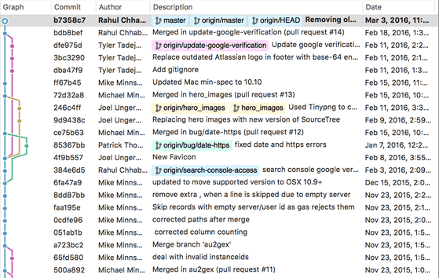

<BlogHeader />

After reading (the excellent) [Think like (a) Git](http://think-like-a-git.net/)
it reminded me of my own story through git. You can run git commands but if you
don't have a clear idea in your head what is actually happening to your git
history?

## The beginning

Like many people I would have a git repository set up with some branches on it
and I would run a relatively simple command such as:

```bash
git checkout -b bar
```

But never had a visualisation for what this was really doing to my git history.
I would run commands and know that a `checkout` command would mean my local
would now be on a different branch and I would have the changes on that branch.
Or a git `branch` would mean I still keep all my changes but I just have a new
branch name floating in space. A git `merge` I knew combined 2 branches together
on my branch, but what did that mean from a visual perspective?

## Learning years

So after a (short) period of time, maybe a few months, I went googling... and
found something called [Sourcetree](https://www.sourcetreeapp.com/). Sourcetree
has been my go to git tool for many years now, not because it's brilliant. It's
not, it's slow, blotted and you can't do everything you can do on the command
line in it. But it does 1 thing extremely well. **Visualisation**. Sourcetree is
a graphical git tool, which basically means it has a way of what is happening to
your git history using graphs, lines and colours.

This is where I made the bridge to this story from Think like (a) Git. The
article attempts to demystify git by making the reader think visually. When you
think visually about what git does to your history you come across Graph Theory.
Your repository is just a big single graph. Your commits are nodes and you have
a directional edge which says what a node's (commit's) parent is.

Sourcetree (like most graphical git tools) shows this visualisation using
*railroads*:



*(source: https://www.sourcetreeapp.com/)*

With seeing the *railroads* you can start to then link a git history to a simple
directional graph, so that when performing a `branch` or a `merge`, even a
`rebase` you can start to visualise what the change on the **graph* will be
rather than staring blankly into a terminal reading foreign looking text.

Over time would run commands in Sourcetree and see what effect it had on the
graph. This in turn taught me what these commands were actually doing to my
git history.

So a simple `merge` with master I could now visualise in my head as:


*(source: https://www.atlassian.com/git/tutorials/using-branches/git-merge)*

I could see when if I was on `master` and I `merged` a feature branch in, it
would keep the feature branch as is but create a commit on master which bought
in the changes from the feature branch, but retained the full history of both
branches. Over time this knowledge then became useful when resolving merge
conflicts as I understood what commits/branches the 3 parts to a *3-way merge*
were referring to.

## Going full circle

The end of the story goes full circle. Sourcetree is a great tool however it is
slow, and it's a pain to do certain tasks in it. I've never managed to do a
rebase for example in Sourcetree (I'm sure there is a way but I've never found
it/forgotten it due to a nightmare experience). So because I started off in a
terminal using git, I've always felt okay at stepping away from a visual git
tool and using plain old git commands. The frequent example is `rebase` or more
sophisticated commands, such as working out if a branch's head was merged into
another branch.

However know when I use a terminal for git (which is arguably more often then
using Sourcetree), I can visualise what is happening and often I still open up
a visual git tool to see if what I thought was happening, actually happened.

::: tip Take home point
Learning the visualisation changes with a visual git tool will mean you can run
git commands on a terminal at ease.
:::
